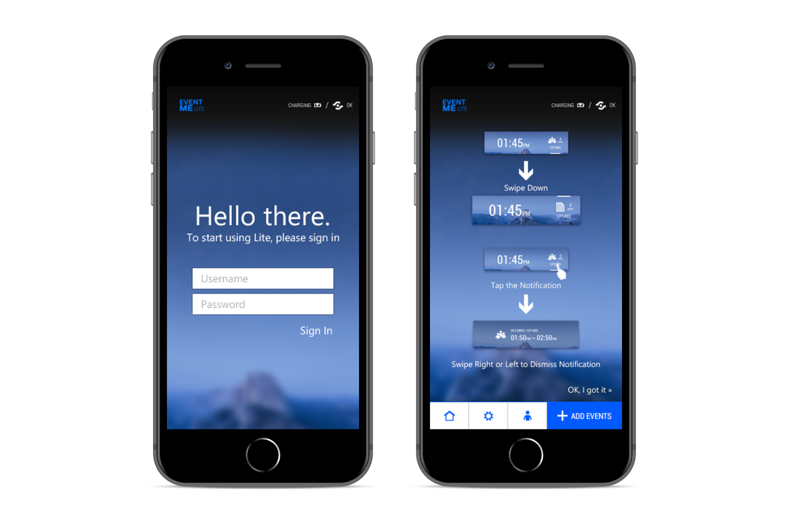
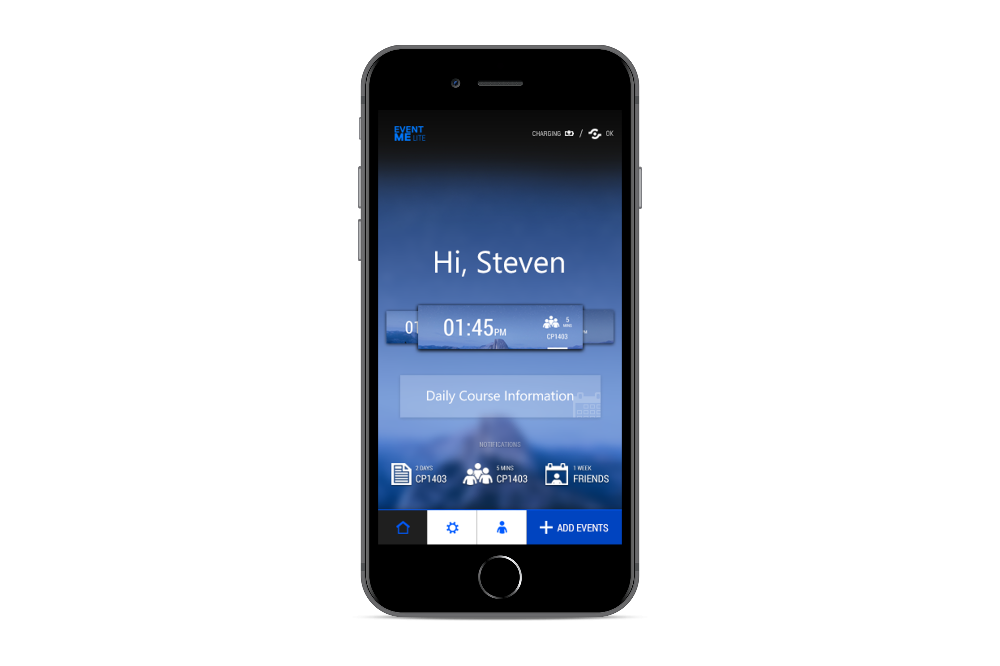
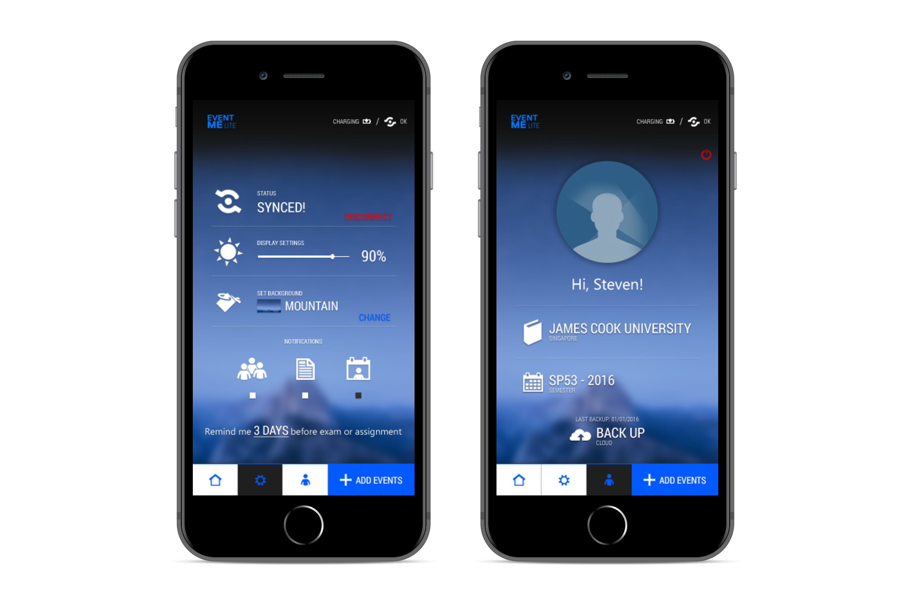
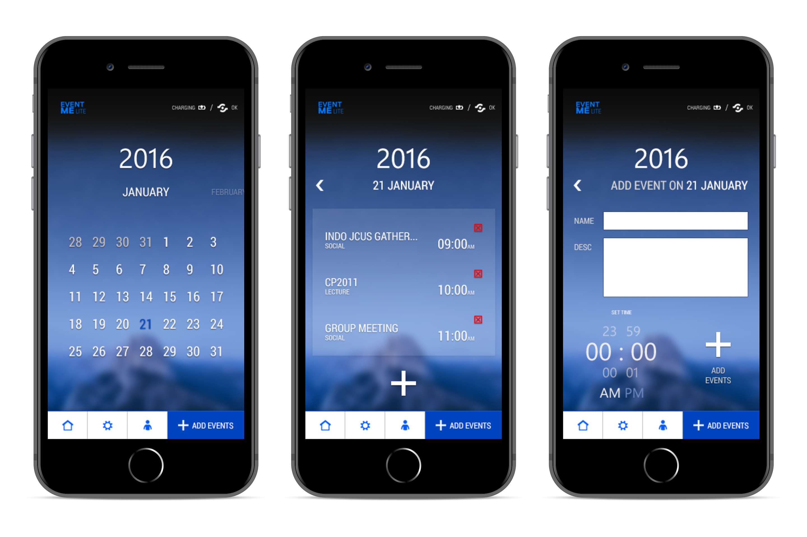
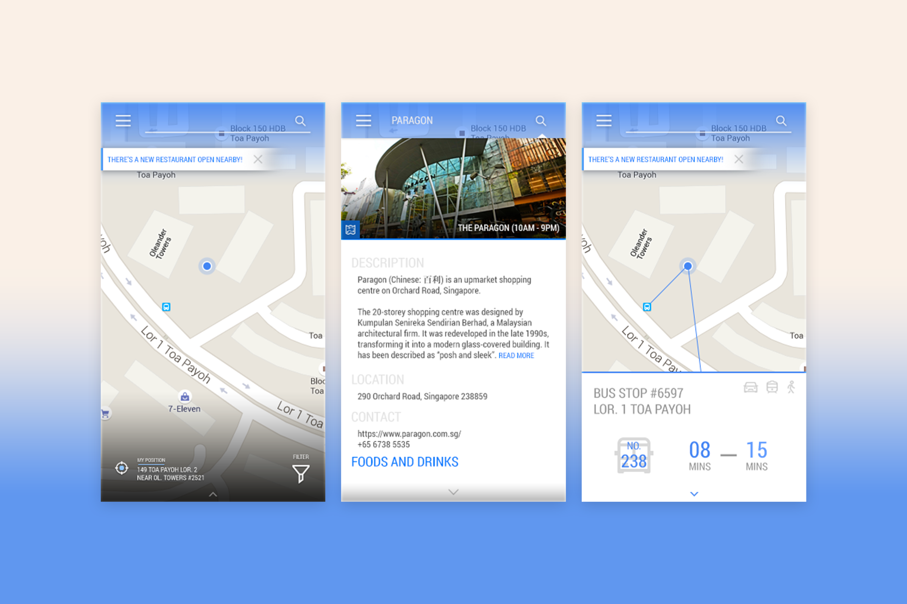
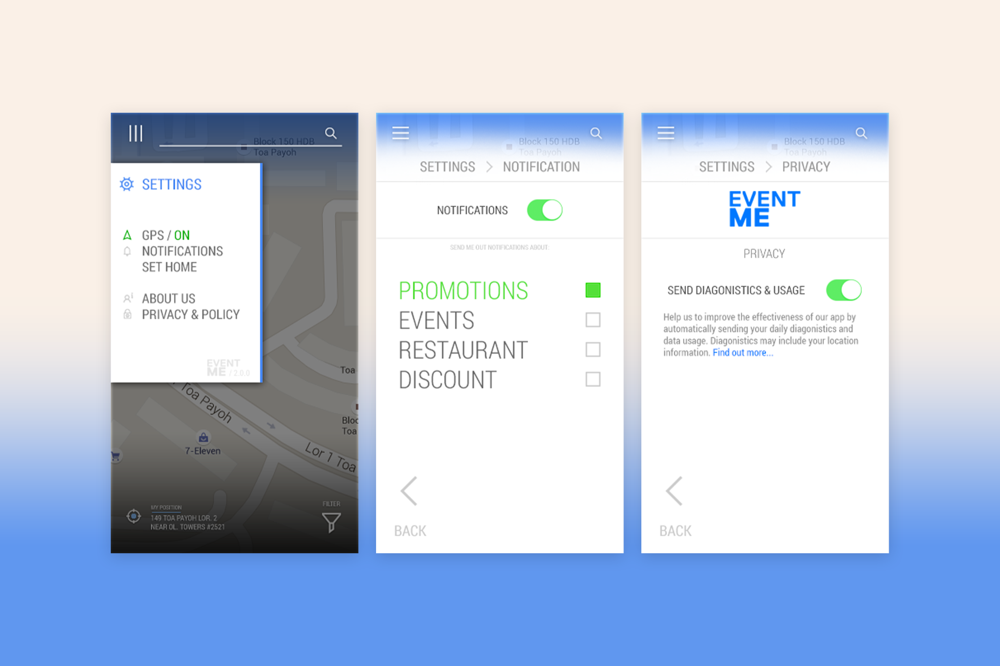

# Brief
My capstone project for my bachelor’s degree was to create an app design that combines strong UI and UX to make student life easier both on and off campus.

The app was designed to provide students with features that enhance campus life, such as class schedules and assignment reminders, ongoing and upcoming campus event notifications, smart band synchronization, maps, and real-time bus tracking.

***

# Design Journal
## Two Sides
EventME was split into two versions: a “Lite” version and a “Pro” version (not the most groundbreaking naming scheme, there!).

The Lite version was designed primarily for on-campus use, meaning its features focused on campus-related activities such as daily course information, assignment due date reminders, and on-campus appointment scheduling synced with a smart band (I used the Samsung Gear Fit as the screen canvas).

*Lite version of the app. When the student logs in for the first time, they will be taken straight to the smart band sync tutorial screen.*

*They will then be taken to the Home, where they can access various features as seen above. They will also be able to freely edit the smart band UI from here.*

*Settings and User screens. The app allows a somewhat level of customization.*

*Adding an event*
 
And the Pro version, on the other hand, was designed for off-campus use. It included a Google Maps-like navigation feature with bus stop integration (something that did not exist yet or was not well implemented in Singapore at the time).

Alongside an “Around Me” feature that allowed students to browse nearby events and receive notifications for student-exclusive promotions, public events, and restaurant recommendations suggested by other EventME users.

Hence the name, EventME.

*Home screen, detailed location page, and bus stop integration.*

*The expanded hamburger menu, and the setttings page.*

### Context
Even though Figma already existed at the time, I unfortunately did not hear about it until early 2018.

As a result, I had to use the newly released Adobe XD for basic prototype interactions, while most of the UI elements were designed in Adobe Photoshop and Adobe Illustrator.

And because this project was completed many years ago, I sadly lost access to my Adobe XD account (which was used for prototyping) because it was tied to my university email address and what remains are only a few low-resolution screenshots that I managed to recover.

I also lost access to the proper case study for the project - and what you see here was mostly recreated entirely from my memory.

Sorry about that!