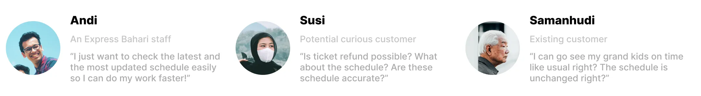
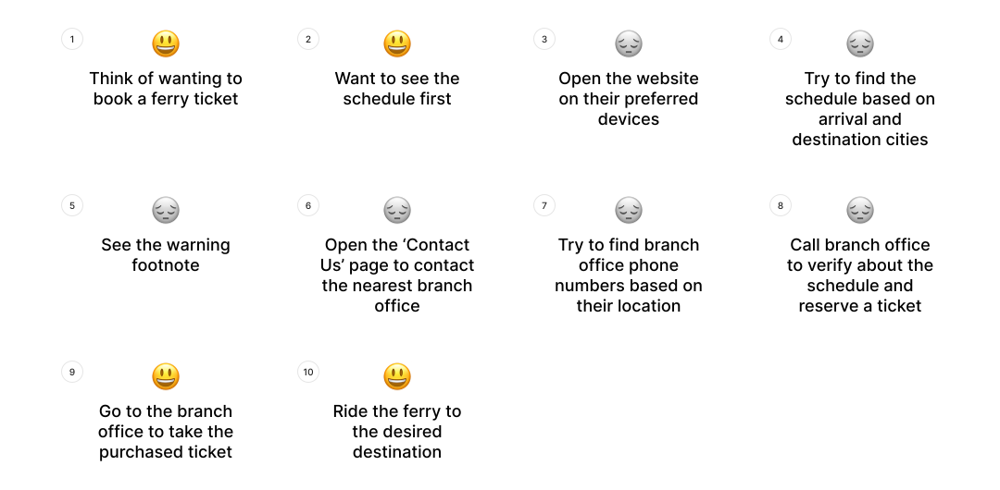
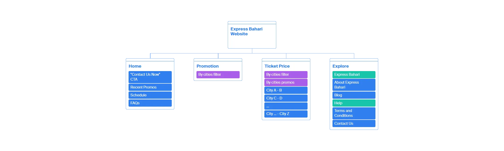
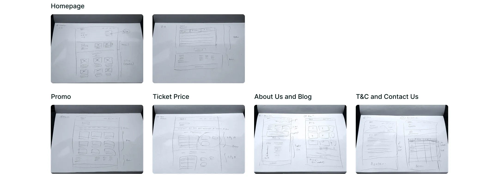
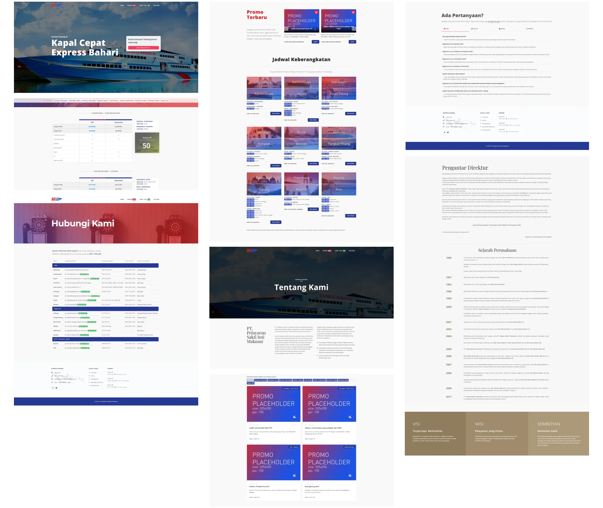
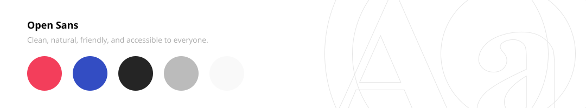

# Brief
Express Bahari, one of the biggest ferry service in Indonesia approached me to do a re-design their website.

With the recent meteoric rise of smartphone users in Indonesia, they decided to upgrade its service by building a responsive website that has location-based ferry timetables, promo selections, and most importantly it has to be user friendly no matter on mobile, tablet, or PC.

Following the redesign, the company liked my design direction and asked me to do UI/UX design for their upcoming smartphone app that has features, such as allowing users to book and see their trip detail, redeem promo codes, push notifications, and rewards system.

***

# Let's Get to Work

## The Problem & The Goal
Problem:
- Both Express Bahari’s clients and staff express their confusion and discouragement while using their website to access important information such as ferry schedule, support and branch offices contact, and location information.

Goal:
- To improve the general usability of the website

### Process Overview

*Process overview of this landing page design project.*

### User Research
## Clarifying the Problem
To gather a better understanding and perspective of the issues above, I sent out surveys to staff (on both main and branch offices) and interviewed walk-in clients.

The goal of these surveys and interviews was to understand their source of confusion and the reason they are not so keen on using the already existing website to find out the information they needed and would resort to contacting branch offices directly which sometimes ended up in bottlenecks during holiday seasons.
  

## Results
Client interviews and staff surveys revealed that:
- The website’s loading time on smartphones is slow
- Website layout is a mess, banners are unreadable on smartphones and the site structure is confusing
- Hard to find the timetable for (destination and arrival) cities
- “Customer Service” section is unclear and takes too much effort to find them:
  - Offices’ phone numbers are impossible to copy
  - Other information is unreadable on smaller screens
  - Can’t go back to the homepage

From these results, I was able to see and understand the perspective that both staff and the client experience in new ways.

Moving forward, I created 3 personas of Express Bahari website users.
1. First are the company’s staffs who want to access the latest ferry schedules,
2. Another is new clients that want to know the ticket prices and want to know whether a ticket refund is possible or not,
3. And the third is the existing clients that want to make sure and know if the ferry schedule is unchanged

*Thee separate different personas.*
 

## User Journey

*User journey, pain points highlighted by the greyed out sad emojis.*

### Wireframing and Prototyping
## Confusing Site Map and Layout
One of the main problems with the existing sitemap is that users required scrolls to the bottom of the page and several clicks to get info on contact information. And when users finally reached those pages, they are still having trouble with accessing contact information on them due to the table not built with responsive web design in mind.

Besides that, they also have trouble with finding relevant questions and answers due to the lack of classification on the FAQs section.

And to make matter worse, most of the navigation links are only present on the bottom part of the website (footer), making users have to scroll so much just to navigate to other pages.

With those points in mind, I used the card sorting method to reorganize and figured out what’s the best way for users to navigate through the website.

*The pages sorted by "cards", each color block represents different things; blue for section, purple for function, and green for head section.*

As users said that they expected a quick and fast way to access office locations and contact information whenever they are looking to book a ticket, I created a new user flow, so that it can guide my design decisions later.
  

## Visualizing the Journey
With my shiny new user flow as my base, I sketched various new user interfaces with multiple screen sizes (mainly smartphone and desktop) for the website.

I also did rapid prototyping to make sure that everything is A-OK before moving on to the more hi-fi prototypes.

*Low fidelity wireframes of the website.*

*Few screenshots of the high fidelity wireframes.*
 

## Let There Be Light
Decisions, decisions.

During deciding on the style of the website user interface, I was faced with two important questions:
1. Should I use the existing design style of the website and improve on it?
2. Or do I radically change the design style to make it more modern and accessible?

Knowing that I can’t solve this problem on my own, I asked for the company’s internal team's opinion.
After a lengthy discussion, I decided to go with the latter option, as they decided that the latter option would have a ripple effect on revitalizing and improve their company’s image too.

I chose Open Sans as my main font family, as it is clean, neutral, friendly yet accessible while being exceptional in its letter-forms. That third point is really important as most of the web pages will be information-dense, I want to make sure that the interface felt inviting and easy to read for the users.

As for the main colors, I decided to use the company's existing logo as my base which ended up me reducing the intensity of the highly noisy red and blue colors on it as it would give the website a more modern feel while still being friendly and open to new users.

*The font and color scheme of the website.*

### Development
## The Hard(ish) Part Begins
After completing the design of the whole website, now I have to start developing the static website.

As this website was always aimed to be responsive, I chose Bootstrap 4 as my base CSS framework with few custom CSS to achieve my design goals, used JavaScript to add few custom functions to the website, and used semantic HTML to make sure that the back-end developers would have a much easier time doing their back-end magic after the handover.

Aside from that, I also have to make sure that the website loads faster by making sure that the static images are well optimized enough.

But that's a story for another day, since this is a design and not a development journal.

### Outcome
## Good News
After few weeks of completing the website re-design project, the company sent out few surveys to their customers.

The survey result came and stated that they are less likely to call branch offices as they already find what they want on the website – which could lead to fewer bottlenecks during the holiday season, they find the website being easy to use and load much faster than before and readability issue are no more.
  

## Another One
Following the website re-design, the company liked my design direction and asked me whether I could do UI/UX design for their upcoming smartphone app.

***

# The App

## New Task
Having previously redesigned the Express Bahari website, the company later asked me to design the UI and UX for their upcoming smartphone app, with functions such as allowing users to book trips, view trip details, redeem promo codes, receive push notifications, and access a rewards system.
  

## Look and Looked
Their internal team later took more creative freedom with the final user interface design while still basing most of the layout on my original design ([the version currently on the Google Play Store](https://play.google.com/store/apps/details?id=com.expressbahari.android&hl=id)).
 

Check out how mine looks below:

<iframe
  src="https://embed.figma.com/proto/r0eXArW9CuWvagdOSXOhCb/%F0%9F%92%BC-Express-Bahari---App-Design?embed-host=owynn&node-id=1-2"
  height="600px"
  width="100%"
  theme="dark"
  allowfullscreen
>
</iframe>