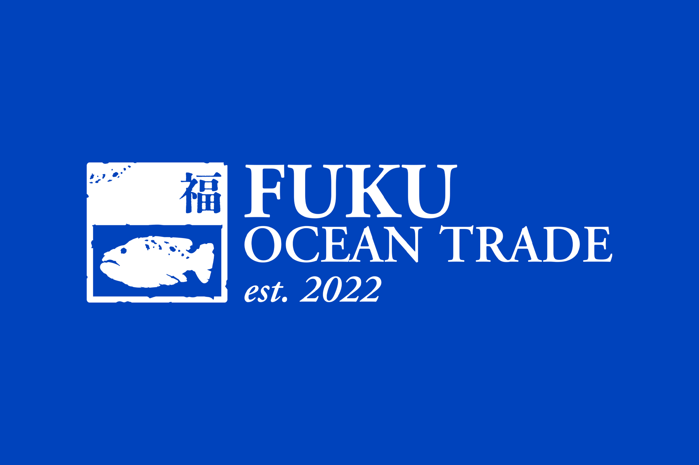
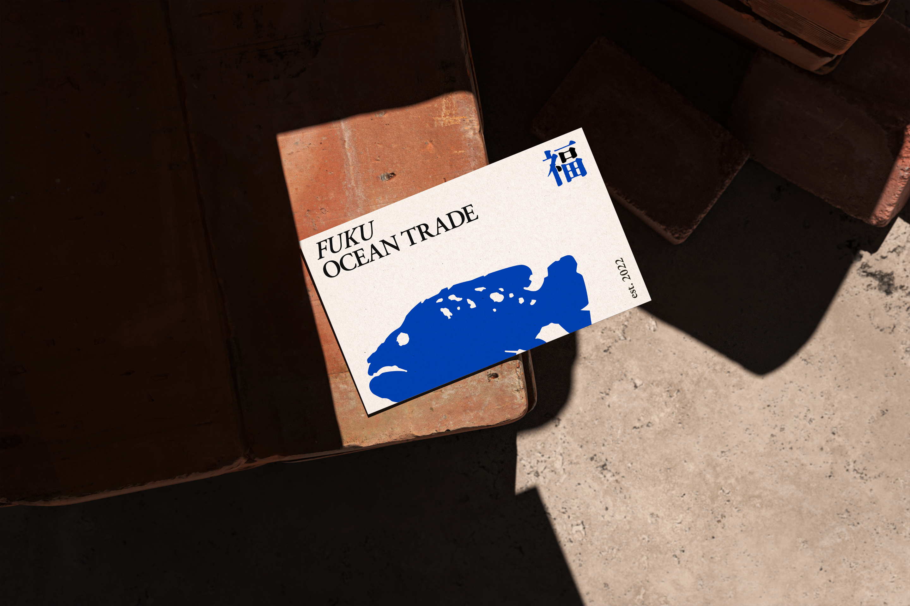
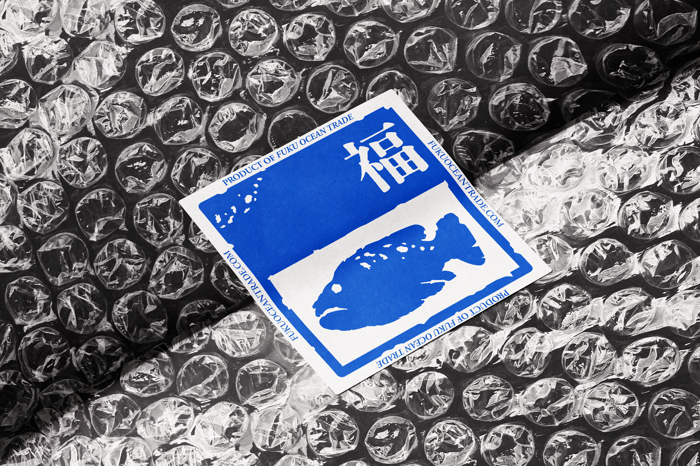
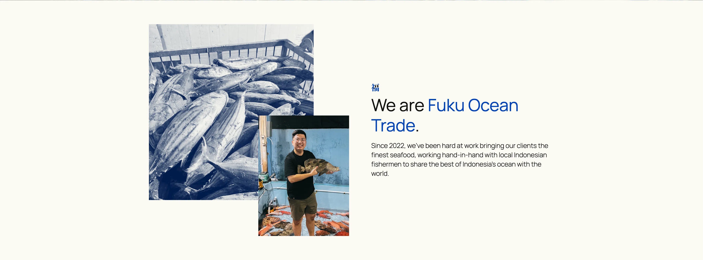
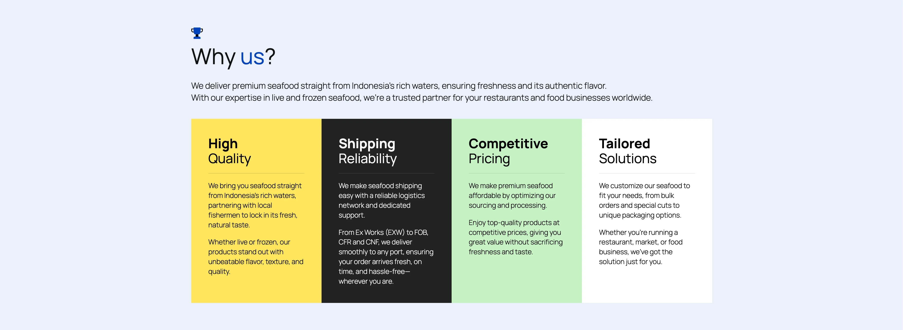
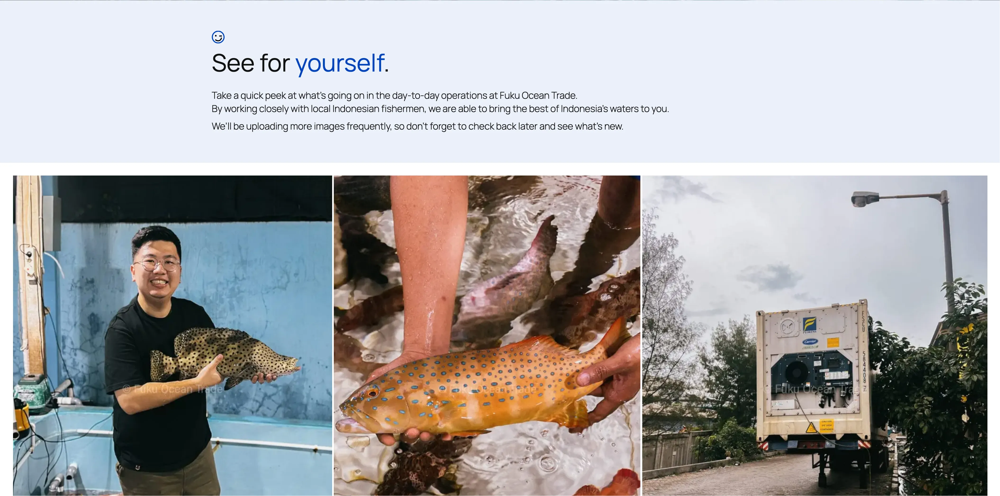
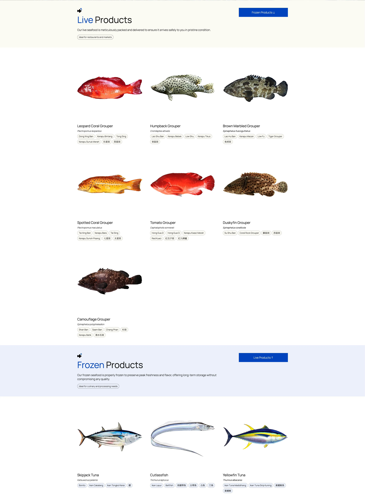
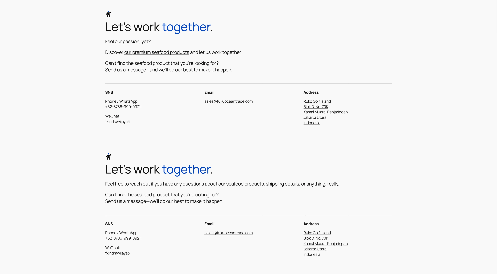

# Brief
Indra, a close friend of mine, asked me in early 2025 to create a brand design for his new venture called “Fuku Ocean Trade” - a seafood trading company that first humbly began as his side hustle in 2022 and has been growing rapidly since.

Wanting to reach a wider and more international audience, he told me that he wants 2 things: a professional-looking website and a brand that will be able to convey what the company does and stands for.
 

*Inspired by the Japanese and Chinese word 福 (fuku / fú), meaning “good fortune,” and its seafood trading, with a specialty in groupers.*

*250gsm textured name card featuring a striking grouper iconography and the character 福 (fuku) on the front with contact details at the back.*

*Besides helping secure export packaging, custom stickers also make it easier for customers to recognize Fuku Ocean Trade as a brand.*

***

# The Second Half
With the first half of the project done, I moved on to the second part - web design and development.

From the start, I knew that I wanted the website to make potential customers feel a sense of trust. With that in mind, I began sketching out (not pictured here, sorry!) the layout and drafting the website content, shaping both around that core idea.

*A brief introduction section with Indra's face right under the hero section.*

After some back-and-forth discussion with Indra himself, he agreed with my suggestion to feature his photo and his haul in the homepage hero section.

This is especially important since most users only stay for around 15 seconds, so establishing trust quickly matters - [and using a genuine photo of him “in action” helps achieve that](https://news.cornell.edu/stories/2019/01/seeing-believing-depends-photo-quality-study-says).

And to further build on that sense of trust, I also added a “Why Us?” section and a “Behind the Scenes” page.

And of course, the website also needed a catalogue of sorts, serving as a clear and structured way for our potential clients to browse and understand what products are available for order.

I also retouched the product images to create a more cohesive look, as the original photos felt a bit too ‘raw’.

Oh, I also included the alternative names that I painstakingly had to research, to further add context to what each product is.

*Aside from the names, I also did stylized edits on each fish using real pictures as the base for a more cohesive look.*

I also added a contact section on each page so visitors can easily see how to get in touch with Fuku Ocean Trade easily while browsing the site.

The copywriting on these are also slightly customized for each page, depending on the context.

*Pictured above are two different “Let's work together” sections on two separate pages.*

### Outcome
This whole project took about a month to complete, and overall I’m quite satisfied with how it turned out.

And fortunately, Indra felt the same too.

Since then, Fuku Ocean Trade has grown quite a bit - it now exports seafood products to two new countries, Vietnam and Malaysia, and many of the clients there discovered the business through the website.