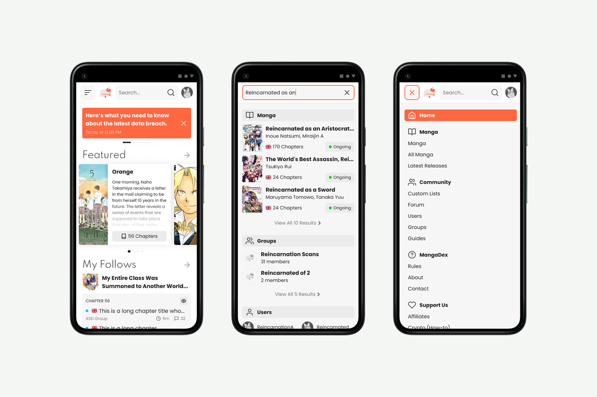
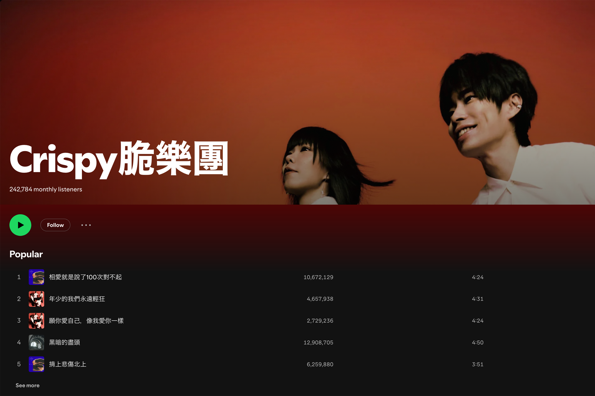
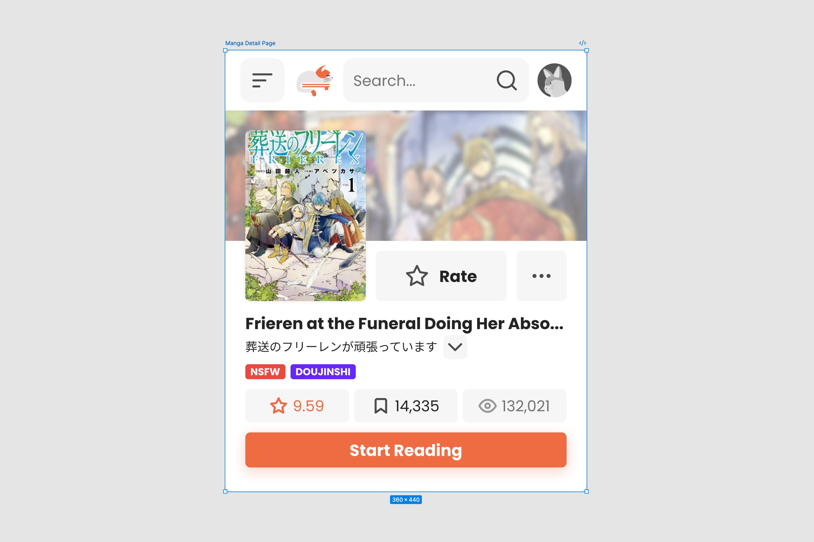
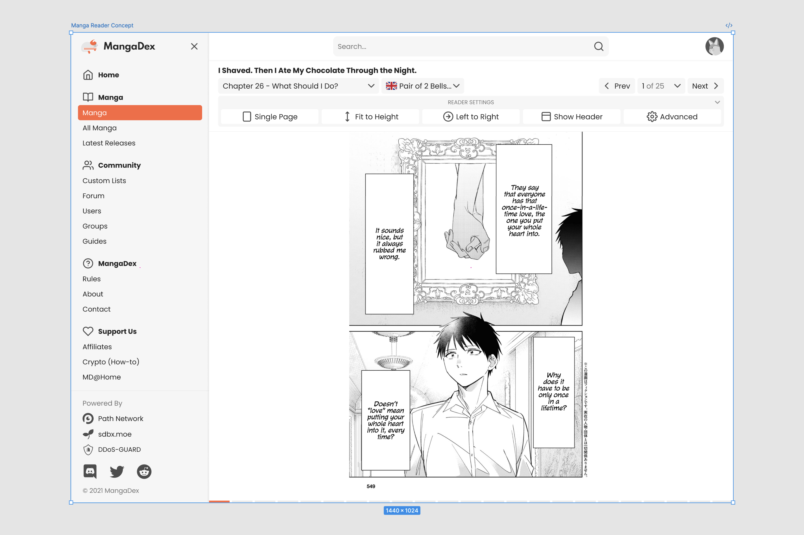

# Brief
MangaDex is a fan-driven, fan-made online manga reader made for scanlators and readers to give them a safe place to discover and experience their favorite manga with high-quality translations and ways to support their favorite authors.

Charmed by their work, I decided to volunteer as their UI/UX designer for their new planned site rewrite, called v5.

As luck may have it, a few weeks after I joined their design team, the site was attacked by an unknown actor. During this period, the MangaDex team decided to refocus and expedite their planned rewrite of the site.

***

# What I Did

When I first joined the design team, Arvid immediately asked me to start working on the following:
- To design my own take on the mobile version of the homepage
- The search results page
- The expanded hamburger menu
- A manga detail page, including finding a way to display multiple available languages without making the interface feel overwhelming

*Left to right, mobile homepage, search result page, and the expanded hamburger menu*

As for the manga detail page, we ended up choosing Spotify individual artist page design as our main inspiration (pictured below):

*Recent screenshot, but you get the idea - see that big header title and that glorious subtle gradient effect?*

*Using that as inspiration, this was what I came up with*

Since the manga detail page is the second most important area where users spend most of their time interacting with the site, we took our time to make sure it both worked and looked right.

While waiting for input from other team members, I decided to start tackling the manga reader page instead - as this is probably where users spend most of their time interacting with the platform, so creating as many design explorations as possible for this page felt like a good idea since this allowed us to iterate and evaluate which designs worked well and which did not.

*Ta-da, in hindsight I probably should’ve chosen a darker shade of grey for the background to better differentiate the manga page from the background, but oh well*

### Context
The screenshots I am able to share above are limited, as I had to leave the team at the time to focus on my career instead.

That means they are also no longer the most up to date, since several years have passed and the current version of MangaDex may look very, VERY different from what we originally envisioned. If you are curious, you can check it out [here](https://mangadex.org/).

### Thank You
Arvid, sheruchan - if somehow you guys are reading this, thank you!

It was short but I genuinely learned a lot (you guys might have forgotten about me, but oh well!); 
- Arvid taught me how to better manage different designs across different screen ratios, he also introduce me to better ways of organizing Figma components, and
- sheruchan taught me how to design wireframes more effectively and improve my prototyping workflow by looking at her designs